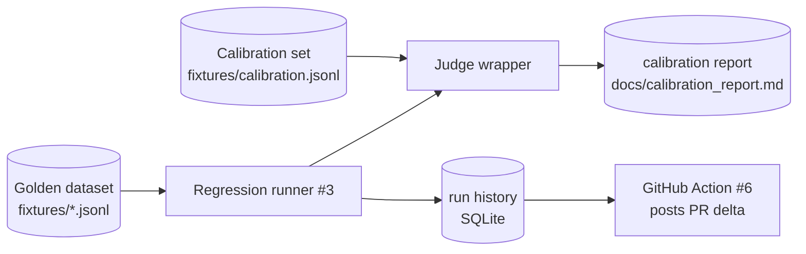

# llm-eval-harness
> Reusable LLM eval framework: versioned golden datasets, LLM-as-judge with calibration against human labels, regression runner, pytest plugin, and GitHub Action for PR-level eval diffs.


## What this is

A small, dep-disciplined Python package every other repo in this
portfolio (rag, agents, cost-optimizer) imports to express its evals as
code. Three pieces shipped today:

1. **Versioned golden datasets** (`fixtures/*.jsonl`). Each line
   carries `id`, `input`, `expected_outputs`, `tags`, `dataset_version`,
   `provenance`. Loader rejects malformed lines with a 1-indexed line
   number; round-trip identity guaranteed.
2. **LLM-as-judge wrapper** (`eval_harness.judge`). A `Judge` scores a
   model response against a rubric and returns a structured verdict
   (`{score, reasoning, raw}`). Backend is a pluggable Protocol so
   tests substitute a deterministic stub without an API key.
3. **Calibration against human labels** (`eval_harness.calibration`).
   Cohen's κ on binarized scores + Pearson r on continuous scores,
   computed against a 50-row human-labeled set committed to the repo.
   The judge is only as good as its agreement with humans on this set;
   the κ ≥ 0.6 threshold is the CI gate.

The framework is opinionated about two things. **No fabricated
benchmarks** — the calibration κ number lands in
`docs/calibration_report.md` only when the operator runs the real CLI
against the real API; the README never carries placeholder numbers.
**Honest disclosure of small-N limitations** — the calibration set is
self-labeled by a single labeler with the limitations spelled out in
[`docs/calibration_format.md`](docs/calibration_format.md), not
pretending to be a multi-rater gold standard.

## Architecture

See [`docs/architecture.md`](docs/architecture.md). The shape:



## Quickstart

Hermetic flow (no API key):

```bash
python3 -m venv .venv && source .venv/bin/activate
pip install -e '.[dev]'
ruff check . && ruff format --check .
pytest                                # 51 hermetic tests pass
```

Real-API calibration run:

```bash
pip install -e '.[judge]'             # adds the anthropic SDK
ANTHROPIC_API_KEY=sk-... eval-harness judge calibrate
# → writes docs/calibration_report.md
# → exits non-zero if Cohen's κ < 0.6
```

Library use (in another repo):

```python
from eval_harness import Judge, calibrate, load_calibration
from eval_harness.judge import AnthropicBackend

judge = Judge(backend=AnthropicBackend())
result = calibrate(judge, load_calibration("fixtures/calibration.jsonl"))
print(result.cohens_kappa, result.pearson_r)
```

## Calibration

The calibration set is **50 rows** of `(prompt, response, human_score)`
triples, intentionally distributed across the score axis (clear-positive,
verbose-positive, partial credit, clear-negative, honest refusal,
off-topic, mostly-faithful, subtle-error, edge-case empty). See
[`docs/calibration_format.md`](docs/calibration_format.md) for the
group breakdown and the honest disclosure of single-labeler limitations.

The calibration report itself
(`docs/calibration_report.md`) is written by `eval-harness judge
calibrate` and committed by the operator after the first successful
run — not before. Per the no-fabricated-benchmarks rule, this README
won't quote a κ number until the report exists.

## Benchmarks / Results

Calibration κ (faithfulness rubric): pending operator's first
`eval-harness judge calibrate` run; will land in
`docs/calibration_report.md` and be referenced here.

## Demo

60-second demo pending until at least the regression runner (#3) lands —
a "demo" of just the dataset + judge layers wouldn't show enough.

## Why these decisions

See [`MEMORY/core_decisions_human.md`](MEMORY/core_decisions_human.md). Notable:

- **D-002.** Dataset `expected_outputs` is a list of typed `{kind, value}` objects.
- **D-003.** `dataset_version` is opaque metadata; one version per file.
- **D-004.** Judge backend is a single-method Protocol so tests substitute a stub.
- **D-005.** Calibration target metric is Cohen's κ on binarized scores + Pearson r on continuous; only κ gates CI.
- **D-006.** Calibration set is self-labeled with explicit honest disclosure of single-labeler limitations.

## License

MIT
