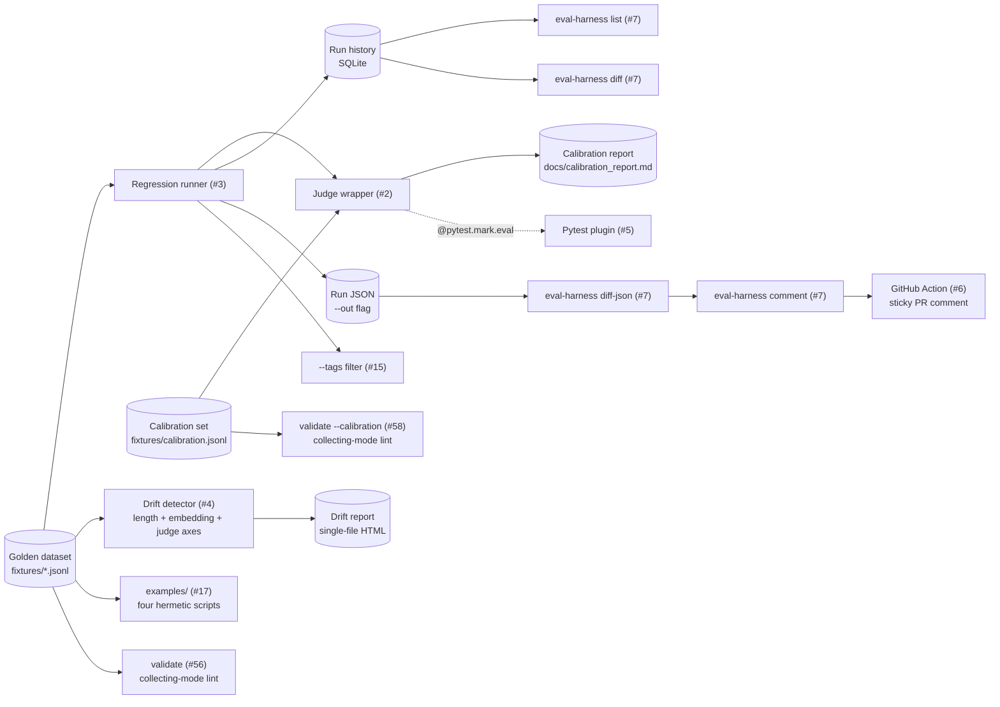

# llm-eval-harness
> Reusable LLM eval framework: versioned golden datasets, LLM-as-judge with calibration against human labels, regression runner, pytest plugin, and GitHub Action for PR-level eval diffs.


## What this is

A small, dep-disciplined Python package every other repo in this
portfolio (rag, agents, cost-optimizer) imports to express its evals as
code. Nine closed issues map to nine pieces of surface:

1. **Versioned golden datasets** (#1) — `fixtures/*.jsonl`. Each line
   carries `id`, `input`, `expected_outputs`, `tags`, `dataset_version`,
   `provenance`. Loader rejects malformed lines with a 1-indexed line
   number; round-trip identity guaranteed.
2. **LLM-as-judge wrapper with calibration** (#2) — `eval_harness.judge`
   and `eval_harness.calibration`. A `Judge` scores a model response
   against a rubric and returns a structured verdict
   (`{score, reasoning, raw}`); calibration is Cohen's κ on binarized
   scores + Pearson r on continuous scores against a 50-row
   human-labeled set committed to the repo. The κ ≥ 0.6 threshold is
   the CI gate (D-005).
3. **Regression runner with per-model diff** (#3) — `eval-harness run`
   stores each row's verdict in a SQLite history (D-008) and exits
   non-zero when any row regresses by more than `--threshold-drop`.
   `eval-harness diff` and `eval-harness list` exposed for ad-hoc
   comparison.
4. **Drift detection** (#4) — `eval-harness drift` scores three
   distribution-shift axes (length, embedding-cluster, judge) with
   Jensen-Shannon divergence (D-014) and renders a single-file HTML
   report.
5. **Pytest plugin** (#5) — `@pytest.mark.eval(...)` parametrizes a
   single test once per dataset row; thresholds assert in the call
   phase (D-013) so failures count as test failures, not test errors.
6. **GitHub Action** (#6) — `.github/workflows/eval.yml` posts a
   self-updating sticky comment with the per-row Δ between
   `fixtures/demo_current.json` and `fixtures/demo_baseline.json`.
   Downstream repos use `eval-harness diff-json` + `eval-harness
   comment` to do the same on their own PRs.
7. **CLI** (#7) — `eval-harness run | list | calibrate | diff |
   diff-json | comment | drift | validate` (plus `judge calibrate` as a
   hidden backwards-compat alias).
8. **--tags row-level subset filter** (#15) — set-union match over the
   dataset's per-row `tags`; exit code 2 with the dataset's tag
   inventory on stderr when the filter matches zero rows.
9. **Runnable examples** (#17) — `examples/` ships four self-contained
   scripts (judge + calibration stub; regression run + diff; drift
   report; pytest-eval pattern) each smoke-tested in CI so the
   snippets can't bitrot.
10. **Dataset validator** (#56) — `eval-harness validate <path>` walks
    a JSONL golden in *collecting* mode and surfaces every malformed
    row in one pass (parse errors, schema errors, duplicate ids,
    version-drift). Exits 0 clean / 1 findings / 2 I/O error so a CI
    step can gate `run` on a clean dataset without spending judge
    tokens to discover shape errors.
11. **Calibration validator** (#58) — `eval-harness validate
    --calibration <path>` runs the same collecting-mode walk against
    the calibration JSONL schema (`human_score` / `prompt` / `response`
    / `rubric`), with a calibration-specific `score_range` finding code
    for `human_score` outside `[0, 1]`. Returns the same
    `ValidationReport` JSON shape so CI consumers can route both kinds
    uniformly. Pre-flight gate for `eval-harness calibrate` (D-005),
    closing the same lint-without-tokens loop on the κ-gating set.

The framework is opinionated about two things. **No fabricated
benchmarks** — the calibration κ number lands in
`docs/calibration_report.md` only when the operator runs the real CLI
against the real API; the README never carries placeholder numbers.
**Honest disclosure of small-N limitations** — the calibration set is
self-labeled by a single labeler with the limitations spelled out in
[`docs/calibration_format.md`](docs/calibration_format.md), not
pretending to be a multi-rater gold standard.

## Architecture

See [`docs/architecture.md`](docs/architecture.md) for the integrated flow,
per-layer detail, and the design decisions behind each one (D-002…D-015).
The shape:



## Quickstart

Hermetic flow (no API key):

```bash
python3 -m venv .venv && source .venv/bin/activate
pip install -e '.[dev]'
ruff check . && ruff format --check .
pytest                                # full hermetic suite (no API key)
```

Real-API calibration run:

```bash
pip install -e '.[judge]'             # adds the anthropic SDK
ANTHROPIC_API_KEY=sk-... eval-harness calibrate
# → writes docs/calibration_report.md
# → exits non-zero if Cohen's κ < 0.6
```

(Scripts that already invoke the legacy `eval-harness judge calibrate`
form still work — it's a hidden backwards-compat alias; canonical is
the top-level `calibrate` subcommand.)

Library use (in another repo):

```python
from eval_harness import Judge, calibrate, load_calibration
from eval_harness.judge import AnthropicBackend

judge = Judge(backend=AnthropicBackend())
result = calibrate(judge, load_calibration("fixtures/calibration.jsonl"))
print(result.cohens_kappa, result.pearson_r)
```

### Examples

Self-contained runnable examples live in [`examples/`](examples/). Each one
runs end-to-end on a fresh clone without an API key (stub backends and
`DatasetEchoSource` keep everything hermetic) and is smoke-tested in CI by
`tests/test_examples_smoke.py` so the snippets can't bitrot.

| File | Shows |
|------|-------|
| [`examples/judge_calibration_stub.py`](examples/judge_calibration_stub.py) | Wiring `Judge` + `calibrate` against a stub `Backend` over `fixtures/calibration.jsonl`; prints κ and Pearson r. |
| [`examples/regression_run_and_diff.py`](examples/regression_run_and_diff.py) | Two `run_suite` calls against the same dataset with deterministic backends, then `diff_runs` + `render_delta_ascii` to surface the regressed row. SQLite history lives in a tempdir. |
| [`examples/drift_report.py`](examples/drift_report.py) | `compute_drift` across length / embedding / judge axes on a synthetic golden vs. shifted input pair; writes the single-file HTML report to a tempfile. |
| [`examples/pytest_eval.py`](examples/pytest_eval.py) | `@pytest.mark.eval(...)` parametrizing over a dataset with stub backends — the same pattern a downstream repo wires into its own `pytest` run. |

Each example swaps cleanly to the live Anthropic backend by replacing the stub
with `AnthropicBackend()` (which requires the `judge` extra and an
`ANTHROPIC_API_KEY`); the rest of the wiring is identical.

### Dataset validator (#56)

Lint a JSONL dataset without spending judge tokens. Walks the file in
*collecting* mode so a single command reports every malformed row
rather than the first:

```bash
eval-harness validate fixtures/sample_factuality_v1.jsonl
# → stdout: ok: fixtures/sample_factuality_v1.jsonl rows=8 valid=8 findings=0 version=factuality-v0.1
# → exit 0
```

```bash
eval-harness validate fixtures/broken.jsonl --json
# → stdout: { "ok": false, "n_rows": …, "n_valid": …, "findings": [...] }
# → exit 1 (any findings); exit 2 (file missing / I/O error)
```

Finding codes (`parse` / `schema` / `duplicate_id` / `version_drift` /
`empty`) are stable so CI consumers can route on shape without parsing
the human-readable reason. The library entry point is
`eval_harness.validate_dataset(path) -> ValidationReport`.

`--out PATH` writes the rendered output (text summary or `--json` payload)
atomically to a file instead of stdout (parity with
`run --out` / `list --out` / `diff --out` / `diff-json --out`).
Findings still print to stderr in human-readable mode even when `--out`
is set, so the operator's diagnostic channel is preserved when stdout
is captured to a file:

```bash
eval-harness validate fixtures/broken.jsonl --json --out report.json
# → atomic-writes the report dict to report.json; stdout silent
# → exit 1 (any findings); exit 2 leaves --out untouched
```

### Calibration validator (#58)

The calibration set (`fixtures/calibration.jsonl`) has its own schema
(`human_score` / `prompt` / `response` / `rubric` / `provenance` /
`id`). `--calibration` routes the same `validate` subcommand to a
calibration-aware walker so the κ-gating dataset gets the same
lint-without-tokens treatment as the golden datasets:

```bash
eval-harness validate --calibration fixtures/calibration.jsonl
# → stdout: ok: fixtures/calibration.jsonl rows=8 valid=8 findings=0 version=calibration
# → exit 0
```

Calibration-specific finding codes: `parse` / `schema` /
`duplicate_id` / `score_range` (for `human_score` outside `[0, 1]`) /
`empty`. The return type is the same `ValidationReport`, with
`dataset_version=None` and `tag_counts=()` (no equivalent fields on
the calibration schema). Library entry point:
`eval_harness.validate_calibration(path) -> ValidationReport`.

### Regression runner

Score a dataset, persist the run, and diff against the previous run for
the same suite. Exits non-zero when any row regresses by more than
`--threshold-drop` (default `0.1`):

```bash
# First run: store as the baseline.
ANTHROPIC_API_KEY=sk-... eval-harness run \
  --suite faithfulness \
  --dataset fixtures/sample_factuality_v1.jsonl \
  --no-diff

# Later run: same command without --no-diff prints a delta table.
ANTHROPIC_API_KEY=sk-... eval-harness run \
  --suite faithfulness \
  --dataset fixtures/sample_factuality_v1.jsonl
# → stdout: the run's JSON
# → stderr: an ASCII delta table; exit code 1 if any row drops > 0.1
```

Score a subset by tag with `--tags` (comma-separated, set-union match —
any row whose `tags` intersects the requested set is included):

```bash
eval-harness run \
  --suite faithfulness \
  --dataset fixtures/sample_factuality_v1.jsonl \
  --tags geography,history \
  --no-diff
# → scores only the geography + history rows.
# → exits 2 with the dataset's tag inventory on stderr if --tags matches zero rows.
```

Run history is stored in SQLite at `~/.eval-harness/runs.db` (override
with `--db`); two tables, `runs` and `rows`, with a foreign key from
`rows` to `runs`. `eval-harness diff --current <run_id> --baseline
<run_id>` is also exposed for comparing any two specific runs.

`eval-harness list` shows the most recent runs from the same DB:

```bash
$ eval-harness list --limit 5
started_at            run_id        suite         mean   rows  judge_model
--------------------  ------------  ------------  -----  ----  -----------
2026-05-16T08:42:00Z  a1b2c3d4e5f6  faithfulness  0.910  8     claude-haiku-4-5
2026-05-15T19:15:00Z  9f8e7d6c5b4a  faithfulness  0.895  8     claude-haiku-4-5
...
```

Pass `--suite <name>` to filter, `--json` for machine output.

A separate `AnswerSource` Protocol (D-007) is the *model under test* —
distinct from the judge model so the runner can score one model's
answers with another model's judge. The default `DatasetEchoSource`
emits the example's first `expected_outputs.value` so the runner can
be exercised hermetically before a real source is wired.

### Pytest plugin: evals as tests (#5)

`eval-harness` registers a pytest plugin via `pytest11`, so any project
that installs the package can mark a test with `@pytest.mark.eval(...)`
and the plugin will parametrize it once per row in the cited dataset.
Each row becomes its own pytest item (visible with the row id as the
parametrize label); the plugin asserts `score >= threshold` and on
failure surfaces the row id, expected outputs, the actual response, the
judge score, and the judge's reasoning.

```python
import pytest
from eval_harness.judge import AnthropicBackend
from eval_harness.runner import DatasetEchoSource

@pytest.mark.eval(
    suite="faithfulness",
    dataset="fixtures/sample_factuality_v1.jsonl",
    answer_source=DatasetEchoSource(),    # or your own model under test
    judge_backend=AnthropicBackend(),     # stub backends work in CI
    threshold=0.6,
)
def test_faithfulness_eval(eval_row, judge_score):
    # Body is optional — the plugin asserts the threshold automatically.
    # Reference `judge_score` (a `JudgeScore` dataclass) if you want
    # row-level invariants beyond the threshold.
    pass
```

The plugin parametrizes via `pytest_generate_tests`, so `pytest -k`,
`--collect-only`, and pytest-xdist all work unchanged.

### GitHub Action: sticky eval-delta comments on PRs (#6)

The `eval` workflow (`.github/workflows/eval.yml`) runs on every PR
and posts a single self-updating comment with the per-row Δ between
`fixtures/demo_current.json` and `fixtures/demo_baseline.json`. The
comment is identified by a hidden HTML marker
(`<!-- eval-harness:sticky-comment -->`) so it's edited in place on
every push — no duplicates pile up across the PR's lifetime (D-009).

Downstream repos that import `eval-harness` use the same two CLI
steps in their own workflow:

```yaml
- run: eval-harness diff-json \
    --current  results/current.json \
    --baseline fixtures/main-baseline.json \
    --format json --out /tmp/delta.json
- run: eval-harness comment \
    --repo ${{ github.repository }} \
    --pr   ${{ github.event.pull_request.number }} \
    --delta-json /tmp/delta.json
  env: { GITHUB_TOKEN: ${{ secrets.GITHUB_TOKEN }} }
```

`diff-json` is SQLite-free (D-010) — it diffs two `RunResult` JSON
files produced by `eval-harness run --out`. Action runners are
ephemeral; making the diff a pure JSON operation matches that.

### Drift detection on production traffic samples (#4)

```bash
eval-harness drift \
    --golden    fixtures/drift/golden_inputs.jsonl \
    --candidate fixtures/drift/shifted.jsonl \
    --output    /tmp/drift.html \
    --judge-stub
# stdout: length=0.4012 (drifted), embedding=0.2783 (drifted), judge=0.3094 (drifted)
```

Three axes are scored:

- **Length** — char-count histogram of inputs.
- **Embedding cluster** — a dep-free hash embedder (lexical-overlap
  pattern, deterministic, no API key) builds k=8 cluster centroids
  from the golden set; each candidate input is assigned to its
  nearest centroid by cosine; cluster-id histograms are compared.
- **Judge** — operator-supplied `judge_score_fn(input) -> float`. The
  axis is *skipped* (not scored) when no function is provided so the
  rest of the report still renders. `--judge-stub` is a deterministic
  word-count stub for hermetic CI / smoke testing.

Each axis returns a Jensen-Shannon divergence in `[0, 1]` and a status
(`ok` / `drifted`) against a per-axis threshold. JSD is bounded and
symmetric — the choice is recorded as D-014: KL is unbounded and
asymmetric; KS only works for ordered scalars (it doesn't generalize
to the cluster-id axis); JSD does both with one formula and one
threshold per axis.

The output HTML report is single-file (inline SVG, no external CDN)
and lists the most-distant candidate inputs from any golden centroid
so the operator can eyeball what the drift looks like.

Library API (when wiring into a custom workflow):

```python
from eval_harness import compute_drift, render_drift_html

report = compute_drift(
    golden_inputs=[...],     # list[str] from your golden dataset
    candidate_inputs=[...],  # list[str] sampled from production
    judge_score_fn=lambda s: my_judge.score(s, s).score,
)
Path("drift.html").write_text(render_drift_html(report))
```

## Calibration

The calibration set is **50 rows** of `(prompt, response, human_score)`
triples, intentionally distributed across the score axis (clear-positive,
verbose-positive, partial credit, clear-negative, honest refusal,
off-topic, mostly-faithful, subtle-error, edge-case empty). See
[`docs/calibration_format.md`](docs/calibration_format.md) for the
group breakdown and the honest disclosure of single-labeler limitations.

The calibration report itself
(`docs/calibration_report.md`) is written by `eval-harness judge
calibrate` and committed by the operator after the first successful
run — not before. Per the no-fabricated-benchmarks rule, this README
won't quote a κ number until the report exists.

## Benchmarks / Results

Calibration κ (faithfulness rubric): pending operator's first
`eval-harness calibrate` run; will land in
`docs/calibration_report.md` and be referenced here.

## Demo

Today's demo is two commands on a fresh clone — both run without an API
key against the stub backends, which is the same path CI exercises:

```bash
# Regression runner + diff (#3, #7).
python examples/regression_run_and_diff.py

# Single-file drift report (#4, #7).
python examples/drift_report.py
```

The first prints a delta table showing a deliberately regressed row;
the second writes an HTML drift report to a tempfile and prints its
path. A captured 60-second GIF/video walking through both plus the PR
sticky-comment flow (#6) is tracked in **#20**.

## Why these decisions

See [`MEMORY/core_decisions_human.md`](MEMORY/core_decisions_human.md). Notable:

- **D-002.** Dataset `expected_outputs` is a list of typed `{kind, value}` objects.
- **D-003.** `dataset_version` is opaque metadata; one version per file.
- **D-004.** Judge backend is a single-method Protocol so tests substitute a stub.
- **D-005.** Calibration target metric is Cohen's κ on binarized scores + Pearson r on continuous; only κ gates CI.
- **D-006.** Calibration set is self-labeled with explicit honest disclosure of single-labeler limitations.

## License

MIT
