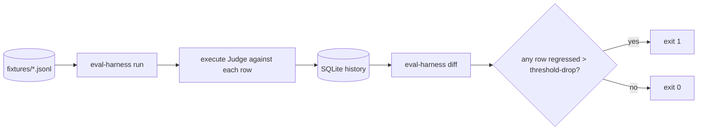
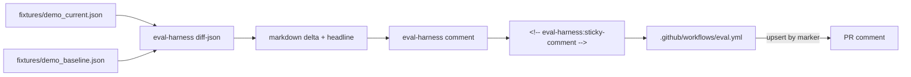

# Architecture

`eval_harness/` is a single Python package layered so each surface
adopts independently. Nine shipped feature issues map to nine pieces
of code; the hygiene surfaces (#19 / #22 / #24 / #27) are not a layer
of their own — they're snapshot tests that keep the README and the
public surface honest as the package evolves.

```
eval_harness/
├── dataset.py          ← #1: JSONL goldens with version pinning
├── judge.py            ← #2: LLM-as-judge with pluggable Backend Protocol
├── calibration.py      ← #2: Cohen's κ + Pearson r against human labels (D-005)
├── runner.py           ← #3: regression runner, threshold gate, exit codes
├── runs.py             ← #3: SQLite-backed run history (D-008)
├── drift.py            ← #4: three-axis Jensen-Shannon drift (D-014)
├── pytest_plugin.py    ← #5: @pytest.mark.eval(...) parametrization (D-013)
├── comment.py          ← #6: sticky-comment renderer + marker-based upsert (D-009)
├── cli.py              ← #7: argparse entry point binding every layer
├── io_utils.py         ← cross-cutting: atomic_write_text (D-015)
├── markdown.py         ← cross-cutting: md_table_cell GFM escaper (#130/#134/#142)
└── __init__.py         ← public surface (#24)
```

Tests in `tests/`; goldens and calibration in `fixtures/`; reports in
`docs/`; runnable examples in `examples/`; the sticky-comment GitHub
Action in `.github/workflows/eval.yml`.

## Layer 1 — Dataset (#1)

`Dataset` and `Example` dataclasses with strict load/dump semantics.
Each example carries `expected_outputs`, a list of typed
`{kind, value}` objects (D-002) so the judge wrapper, the regression
runner, the drift report, and the GitHub Action's sticky comment all
read a single dataset format. `dataset_version` is opaque metadata
(D-003) — the loader enforces internal consistency (every line must
have the same `dataset_version`) but doesn't impose semver or any
specific scheme.

The dataset layer has **zero runtime dependencies** so it can be
imported in environments without an Anthropic API key, in CI
sandboxes, and inside other portfolio repos that consume the harness
as a library.

## Layer 2 — Judge + Calibration (#2)

```mermaid
flowchart LR
  CALLER[caller] --> JUDGE
  JUDGE[Judge.score] --> BACKEND
  BACKEND{Backend Protocol}
  BACKEND -- production --> ANTHROPIC[AnthropicBackend<br/>messages.create]
  BACKEND -- tests --> STUB[StubBackend<br/>deterministic dict lookup]
  ANTHROPIC --> PARSE[parse_judge_output]
  STUB --> PARSE
  PARSE --> SCORE[JudgeScore<br/>{score, reasoning, raw}]
```

The Judge is a thin wrapper: it formats a system+user prompt around
the caller's `(prompt, response, rubric)`, hands the pair to a
single-method `Backend`, and parses the response using a strict
`SCORE: ...\nREASONING: ...` format. Score is clamped to [0, 1].
The Backend Protocol is the load-bearing seam (D-004); production
uses `AnthropicBackend`, tests use a deterministic stub. The
`AnswerSource` Protocol is a separate seam (D-007) — the model
under test must be substitutable independently of the judge model
so one model's outputs can be scored by another model's judge.

Calibration computes Cohen's κ on binarized scores (threshold 0.5)
plus Pearson r on continuous scores against the 50-row human-labeled
set in `fixtures/calibration.jsonl`. The κ ≥ 0.6 threshold gates CI
(D-005); Pearson r is reported alongside because κ alone hides
systematic over/under-scoring biases. The math (`cohens_kappa`,
`pearson_r`) is hand-written against textbook formulas — small enough
to live in this repo without scipy.

## Layer 3 — Regression runner (#3)



`runner.py` orchestrates the per-row score; `runs.py` is the
SQLite-backed history (D-008) — operator runs accumulate into a
single `runs.sqlite` so `eval-harness list` / `eval-harness diff`
can compare across model versions without re-running scoring.
`--threshold-drop` is the regression gate; downstream consumers
(rag-production-kit, llm-cost-optimizer) wire it into their own CI.

## Layer 4 — Drift detection (#4)

`drift.py` computes Jensen-Shannon divergence across three
distribution-shift axes (length, embedding-cluster, judge) per
D-014 — each axis is a separate JSD value so a regression on one
axis doesn't mask stability on the others. `eval-harness drift`
renders a single-file HTML report (no JS, no external CSS) so
operators can attach it to a ticket.

## Layer 5 — Pytest plugin (#5)

`pytest_plugin.py` registers `@pytest.mark.eval(dataset=..., judge=...,
threshold=...)`. The plugin parametrizes a single test function once
per dataset row via `pytest_generate_tests` (D-012, so `pytest -k` and
`pytest --collect-only` keep working alongside `pytest-xdist`); the
threshold assertion fires in the call phase (D-013), not the
collection phase, so failures count as test failures rather than
test errors — which means the standard pytest output formats (xunit,
junit) preserve the per-row signal that a CI dashboard will want.

## Layer 6 — Sticky comment + GitHub Action (#6)



`comment.py` is the sticky-comment renderer. The
`<!-- eval-harness:sticky-comment -->` HTML marker is how the GitHub
Action's upsert step finds and edits the prior comment in place on
every push (D-009) — comment-id-based identity would have stacked
duplicates across pushes. `.github/workflows/eval.yml` is the action
the framework ships; downstream repos use `eval-harness diff-json` +
`eval-harness comment` to do the same on their own PRs.
`diff-json` deliberately operates on two `RunResult` JSON files
without touching the SQLite history (D-010) — CI runners are
ephemeral, so the history layer is for local dev; the action just
needs one current-vs-baseline pair.

## CLI surface (#7)

`cli.py` is the single argparse entry point binding all of the above:

```
eval-harness run | list | calibrate | diff | diff-json | comment | drift | validate
```

Each subcommand has a `--help`; the suite of CLI smoke tests
(`tests/test_cli_*.py`) pins the surface against rename or
removal. The top-level `calibrate` subcommand is the public surface;
`judge calibrate` is kept as a hidden backwards-compat alias (D-011)
so existing scripts keep working. #27 closed a regression where the
alias was visible in `--help`, locked by
`tests/test_cli_judge_alias.py`.

## Cross-cutting surfaces

- **`--tags` row-level subset filter (#15).** Set-union match over a
  row's `tags`; `eval-harness run --tags faithfulness` runs only the
  rows tagged with that label, exit code 2 with the dataset's tag
  inventory on stderr when zero rows match.
- **Runnable examples (#17).** `examples/judge_calibration_stub.py`,
  `examples/regression_run_and_diff.py`,
  `examples/drift_report.py`, `examples/pytest_eval.py` are each
  smoke-tested in CI (`tests/test_examples_smoke.py`) so the README
  snippets can't bitrot.
- **Public surface lock (#24).** `tests/test_public_surface.py`
  asserts `eval_harness.__version__` semver-shape and that every
  name in `eval_harness/__init__.py`'s `__all__` resolves.
- **README + defaults snapshot (#19, #22).**
  `tests/test_readme_snapshot.py` and
  `tests/test_readme_defaults_snapshot.py` lock the README's quoted
  defaults / identifier claims to the source.
- **Dataset validator (#56).** `validate_dataset(path)` walks a JSONL
  golden in *collecting* mode, surfacing every malformed row in one
  pass (vs `load_jsonl`'s fail-fast). Exposed as `eval-harness
  validate <path>` with stable finding codes (`parse` / `schema` /
  `duplicate_id` / `version_drift` / `empty`) so CI consumers can gate
  `run` on a clean dataset without spending judge tokens.
- **Calibration validator (#58).** `validate_calibration(path)` is the
  calibration-side analog: same `ValidationReport` shape, same exit
  codes, but walks the calibration schema (`human_score` / `prompt` /
  `response` / `rubric`) and surfaces a calibration-specific
  `score_range` finding for `human_score` outside `[0, 1]`. CLI is
  `eval-harness validate --calibration <path>`. Pre-flight gate for
  `calibrate` (D-005), closing the same lint-without-tokens loop on
  the κ-gating dataset.
- **Atomic writes (`io_utils.atomic_write_text`, #50).** Every
  `--out` write across `cli.py`, `dataset.py`, and `drift.py` goes
  through one package-level helper (D-015) that writes to
  `<dest>.tmp`, `fsync`s, and `os.replace`s — operators never see a
  half-written report from a Ctrl-C mid-run.
- **Type-checking gate (`[tool.mypy]`, #148).** The annotations shipped
  via the `py.typed` marker (#146) are machine-checked by a non-strict
  `mypy` gate (D-016) run in CI's lint job and locked by
  `tests/test_mypy_clean.py`, so they can't silently drift from the code.
  No blanket `ignore_missing_imports`; the optional `anthropic` SDK is
  the one per-module override.

## What's deliberately not in the harness

- **Live model traffic in tests.** Backend is a Protocol; tests stub it.
- **A web UI.** Per handoff §2, "CLI + CI is enough." PR comments +
  report markdown are the user surface.
- **Multi-rater calibration sets.** Honestly disclosed as future
  work; the current set is self-labeled (D-006) with the limitation
  spelled out in [`docs/calibration_format.md`](calibration_format.md).
- **Replacing `prompt-regression-suite`.** That repo does
  snapshot-style testing; this one does dataset-style scoring. The
  boundary is documented in the cross-repo MEMORY.

## Where to look next

- **Layer code** — `eval_harness/<module>.py` per the directory
  diagram above.
- **Per-layer tests** — `tests/test_<layer>.py`.
- **CLI smoke** — `tests/test_cli_run.py`, `test_cli_list.py`,
  `test_cli_judge_alias.py`.
- **Examples + smoke** — `examples/`, `tests/test_examples_smoke.py`.
- **Design decisions** — `MEMORY/core_decisions_human.md` for prose,
  `MEMORY/core_decisions_ai.md` for the structured log.
