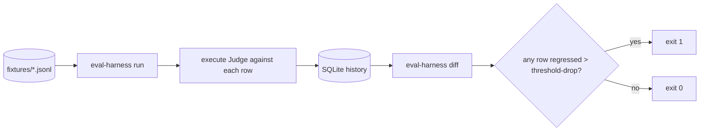
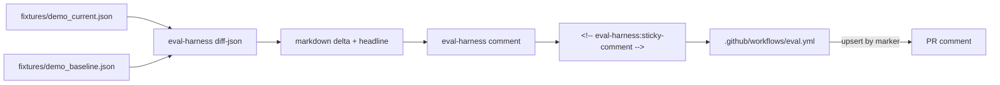

# Architecture

`eval_harness/` is a single Python package layered so each surface
adopts independently. Nine shipped feature issues map to nine pieces
of code; the hygiene surfaces (#19 / #22 / #24 / #27) are not a layer
of their own — they're snapshot tests that keep the README and the
public surface honest as the package evolves.

```
eval_harness/
├── dataset.py          ← #1: JSONL goldens with version pinning
├── judge.py            ← #2: LLM-as-judge with pluggable Backend Protocol
├── calibration.py      ← #2: Cohen's κ + Pearson r against human labels (D-005)
├── runner.py           ← #3: regression runner, threshold gate, exit codes
├── runs.py             ← #3: SQLite-backed run history (D-008)
├── drift.py            ← #4: three-axis Jensen-Shannon drift (D-014),
│                          uncomparable-input handling (D-017)
├── pytest_plugin.py    ← #5: @pytest.mark.eval(...) parametrization (D-013)
├── comment.py          ← #6: sticky-comment renderer + marker-based upsert (D-009)
├── cli.py              ← #7: argparse entry point binding every layer
├── io_utils.py         ← cross-cutting: atomic_write_text (D-015)
├── markdown.py         ← cross-cutting: md_table_cell GFM escaper (#130/#134/#142)
├── comparison.py       ← cross-cutting: render_comparison, so a decided
│                          ordering stays readable (#252, D-026)
└── __init__.py         ← public surface (#24)
```

Tests in `tests/`; goldens and calibration in `fixtures/`; reports in
`docs/`; runnable examples in `examples/`; the sticky-comment GitHub
Action in `.github/workflows/eval.yml`.

## Cross-cutting — rendering a decided comparison (#252, D-026)

Every gate in this package decides at full float precision and then
explains the decision in a string a human reads. Rendering both sides of
that explanation at a fixed three places made the explanation contradict
itself at a near-threshold margin — the ordinary shape of a marginal eval
result, and exactly when someone reads the message most carefully.

Three independent spellings existed before `comparison.py`:
`pytest_plugin.py` asserted `score=0.600 < threshold=0.600` with both
sides at `.3f`; `cli.py` emitted `Cohen's κ 0.600 < threshold 0.6` as a
`::error::` annotation, mixing `.3f` against an unformatted float so the
claim reads **false** rather than merely ambiguous; and
`calibration.render_report` published a `FAIL` beside a `.3f` κ cell and
an unformatted threshold bullet. No test could catch any of them, because
the verdict is correct in every colliding case.

`render_comparison` widens from three places only while the two values
render identically, and always returns both sides at the same precision.
The rule is on the rendered strings rather than on a width, because a
wider fixed width relocates the collision instead of removing it. The
same-precision half is the one that is easy to miss: widening only the
side that needs it looks right for as long as that side carries the long
decimal expansion, which is what happens whenever the threshold is a
round configured number — and `cli.py` was already the counter-example.

Duplicated from `prompt-regression-suite`'s D-012 rather than shared.
The two are separate distributions with no dependency between them, and
manufacturing one so a six-line formatter could be imported would be a
worse trade than the duplication.

This module has the same justification `markdown.py` gives for existing:
that class "kept recurring" because the fix "was written inline at three
call sites". This one also reached three.

## Cross-cutting — copying a free-form JSON field (#254, D-027)

`frozen=True` prevents *rebinding* an attribute. It says nothing about the
object the attribute points at, so a `dict` field on a frozen record stays
editable in place through any reference a caller still holds — and no
`dataclasses.FrozenInstanceError` ever fires, because nothing is rebound.

The defect this fixed was not a *missing* copy. `dataset.Example` was the
repo's best-defended record on this axis: it copied `provenance` on the way
in (`_parse_example`) and on the way out (`to_dict`), and `Dataset.dump_jsonl`'s
docstring calls the second one "load-bearing rather than incidental". Both
were `dict(...)` — one level deep — while `provenance` is documented free-form
JSON. Measured end to end: read `ex.to_dict()`, edit a nested value in the
returned dict, and the frozen `Example` changes; the next `dump_jsonl` writes
the change to the file.

`io_utils.copy_json_value` recurses over `dict` and `list` and leaves
everything else by reference. That is exactly the set of mutable containers
`dump_jsonl`'s faithfulness table *accepts*. Everything else on that table is
rejected at the write seam **with its own type named**, and copying those is
actively wrong — a `namedtuple` rebuilt through `tuple(...)` loses its class,
so the guard that must say `_Point` says `tuple` instead. `set` and
`bytearray` are mutable but have no writer to corrupt, because the record is
refused on the way in and on the way out. `copy.deepcopy` was measured rather
than argued about: it turns eight arms red, because it deep-copies the very
types the table rejects.

`calibration.CalibrationRow` gets the same copy at its constructor and
**not** at a serializer, because it has none. That module declares itself the
analog of `dataset` three separate times — "calibration-side analog of
`validate_dataset`", "matching the ordering `dataset._validate_record` settled
on", "the one choke point both route through" — and the declared parity was
false on exactly this field: `_row_from_dict` passed `obj["provenance"]`
straight through. The remaining asymmetry is deliberate: its own
representability comment says "nothing in this package writes a calibration
record back out", so there is no outbound half, and inventing one for
symmetry would be a guard with no harm to name.

Triaged from the `portfolio-ops#71` worklist, which listed six candidates
here. Two were real; the other four are pinned by name in
`tests/test_frozen_record_provenance_aliasing.py` so a re-run of that sweep
does not re-file them.

## Layer 1 — Dataset (#1)

`Dataset` and `Example` dataclasses with strict load/dump semantics.
Each example carries `expected_outputs`, a list of typed
`{kind, value}` objects (D-002) so the judge wrapper, the regression
runner, the drift report, and the GitHub Action's sticky comment all
read a single dataset format. `dataset_version` is opaque metadata
(D-003) — the loader enforces internal consistency (every line must
have the same `dataset_version`) but doesn't impose semver or any
specific scheme.

The dataset layer has **zero runtime dependencies** so it can be
imported in environments without an Anthropic API key, in CI
sandboxes, and inside other portfolio repos that consume the harness
as a library.

## Layer 2 — Judge + Calibration (#2)

```mermaid
flowchart LR
  CALLER[caller] --> JUDGE
  JUDGE[Judge.score] --> BACKEND
  BACKEND{Backend Protocol}
  BACKEND -- production --> ANTHROPIC[AnthropicBackend<br/>messages.create]
  BACKEND -- tests --> STUB[StubBackend<br/>deterministic dict lookup]
  ANTHROPIC --> PARSE[parse_judge_output]
  STUB --> PARSE
  PARSE --> SCORE[JudgeScore<br/>{score, reasoning, raw}]
```

The Judge is a thin wrapper: it formats a system+user prompt around
the caller's `(prompt, response, rubric)`, hands the pair to a
single-method `Backend`, and parses the response using a strict
`SCORE: ...\nREASONING: ...` format. Score is clamped to [0, 1].
The Backend Protocol is the load-bearing seam (D-004); production
uses `AnthropicBackend`, tests use a deterministic stub. The
`AnswerSource` Protocol is a separate seam (D-007) — the model
under test must be substitutable independently of the judge model
so one model's outputs can be scored by another model's judge.

Calibration computes Cohen's κ on binarized scores (threshold 0.5)
plus Pearson r on continuous scores against the 50-row human-labeled
set in `fixtures/calibration.jsonl`. The κ ≥ 0.6 threshold gates CI
(D-005); Pearson r is reported alongside because κ alone hides
systematic over/under-scoring biases. The math (`cohens_kappa`,
`pearson_r`) is hand-written against textbook formulas — small enough
to live in this repo without scipy.

## Layer 3 — Regression runner (#3)


```mermaid
flowchart LR
  DS[(fixtures/*.jsonl)] --> RUN[eval-harness run]
  RUN --> EXEC[execute Judge against each row]
  EXEC --> HIST[(SQLite history)]
  HIST --> DIFF[eval-harness diff]
  DIFF --> EXIT{any row regressed > threshold-drop?}
  EXIT -- yes --> NONZERO[exit 1]
  EXIT -- no --> ZERO[exit 0]
```

`runner.py` orchestrates the per-row score; `runs.py` is the
SQLite-backed history (D-008) — operator runs accumulate into a
single `runs.sqlite` so `eval-harness list` / `eval-harness diff`
can compare across model versions without re-running scoring.
`--threshold-drop` is the regression gate; downstream consumers
(rag-production-kit, llm-cost-optimizer) wire it into their own CI.

## Layer 4 — Drift detection (#4)

`drift.py` computes Jensen-Shannon divergence across three
distribution-shift axes (length, embedding-cluster, judge) per
D-014 — each axis is a separate JSD value so a regression on one
axis doesn't mask stability on the others. `eval-harness drift`
renders a single-file HTML report (no JS, no external CSS) so
operators can attach it to a ticket.

All three axes have a blind spot D-014's choice creates, reported by
D-023 and D-024. A JSD over a histogram is invariant to how candidate
mass redistributes among buckets the golden set never occupies: each
such bucket contributes exactly `q_i / 2` regardless of which one holds
the mass, so an input can move several buckets further out without
moving the score by a bit. All 28 redistributions of the demo corpus's
6 out-of-support inputs give the identical `0.5689626904850149`, and
their total contribution is exactly half the out-of-support fraction —
`0.375` of that `0.5690`, about 66%, frozen. This is correct for a
categorical divergence over unordered buckets rather than a defect, so
it is documented and counted instead of changed:
`n_length_off_support`, `n_embedding_off_support` and
`n_judge_off_support` carry the mass in that frozen regime, with `None`
on the judge slot when the axis is skipped. Same posture as D-017 below
— what an axis cannot see is a first-class count. The counts say how
much of a score is frozen, not how far the mass has gone; nothing here
says the latter.

D-023 first excluded the embedding axis, reasoning that it assigns
every comparable candidate to *some* golden centroid rather than
bucketing over a fixed domain. True, and beside the point: the support
is the set of buckets the **golden** histogram occupies, and `_kmeans`
retains a centroid whose cluster went empty rather than dropping it, so
a cluster carrying no golden mass is reachable and candidates land in
it (D-024, #246). The embedding count's denominator is the *clustered*
candidate count rather than `n_candidate`, because this axis excludes
uncomparable inputs and the frozen fraction is taken over the histogram
the JSD normalizes.

That same population rule governs the *ranking*, not only the count
(D-025, #248). `representative_examples` scored each candidate by its
distance to the nearest centroid that exists, under a field named
`distance_to_nearest_golden_cluster` — so for exactly the candidates
D-024 proved reachable, it measured the distance to a centroid no
golden input occupies. It is an understatement by construction rather
than a coin flip: a candidate is assigned to the cluster whose centroid
it is nearest, so one in a golden-empty cluster is necessarily closer
to that empty centroid than to any occupied one, and the inputs the
list exists to surface were reported as more golden-like than they
are. Because the list is *truncated*, this is #210's shape again — not
merely a wrong ordering but a wrong membership: over 60,000 random
corpora, 677 had a golden-empty centroid and one of those evicted the
golden-empty-cluster candidate from the top 5 in favour of an input
inside the golden support. The ranking now runs over the occupied
clusters only, which is total because `centroids` is seeded from the
comparable golden vectors and a golden set with nothing comparable is
rejected outright (D-017). Nothing shipped moves: the drift fixtures
leave no cluster golden-empty.

The embedding axis has a domain the other two don't: `hash_embed`
returns the all-zero vector for an input with no alphanumeric tokens,
and the zero vector has no angle to any centroid. Per D-017 such an
input is *uncomparable*, not maximally distant — it is counted in
`DriftReport.n_uncomparable` and excluded from the cluster histograms
and from `representative_examples`, while still taking part in the
length and judge axes. The two sides are treated differently on
purpose: an authored golden set with nothing embeddable is rejected
(it can only report a fabricated `ok`), while a sampled candidate
slice is counted, so one emoji in a 10k-line traffic file does not
abort the run (#210).

That asymmetry is about *embeddability*, and D-018 marks where it stops.
An input with no UTF-8 encoding — a lone surrogate, legal JSON escape
syntax with no encoding at all — is not merely unembeddable: the HTML
report cannot be written if one reaches it, because `render_html` puts
raw input text in the representative-example list and `atomic_write_text`
encodes to UTF-8. Both sides reject, at `compute_drift`, which is the one
choke point the CLI road and the README's library road share. Excluding
the row instead would deflate `n_candidate` and both histograms with no
diagnostic — the same false-negative class as #91 and #93. Detection is
shared with `dataset.py`'s representability check (#213) via
`io_utils.find_unencodable`, so the two enforcement sites cannot answer
differently for the same string (#215).

The representative-example cell that `render_html` puts that raw text into
is capped, and the cap is in **characters of text** — `drift._CELL_TEXT_CAP`,
applied by `drift._truncate_text` before `html.escape`, with a `…` marker
when it cuts. The ordering is the contract, not a style choice: until #240
the cell was `html.escape(r.text)[:200]`, which spends the budget on the
*markup*, so every `&`, `<`, `>`, `"` and `'` cost 4–5 characters of it. A
193-character code-review prompt — under the cap, so untouched by it —
rendered 162 characters, silently; an apostrophe-heavy prose row rendered
170 of 412. A markup-measured cut can also land between the `&` and the `;`
of a reference it just produced, emitting a literal `&am` or `&#x` into the
document. Slicing the source first makes that unconstructible. `cli.py`'s
run-id column, `judge.py`'s non-finite-score message and `comment.py`'s
`md_code_span` call all already sliced before escaping; `render_html` was
the one site that did not, and
`tests/test_drift_report_cell_truncation.py` locks the ordering over the
package AST so a second one cannot appear.

`#217` found the third and fourth sites. `io_utils`' own docstring names
four writer families; two had the guard. `calibration.load_calibration`
had none, so a lone surrogate in a calibration row passed
`validate --calibration` clean (`ok … rows=3 valid=3 findings=0`), the
whole set was judged, and `calibrate --report` died at the write with a
raw `UnicodeEncodeError` at exit 1 — the code reserved for "κ below
threshold", so the crash and the legitimate finding were the same
signal, and the tokens were already spent. And `cli._write_output`,
added so that no `--out` site calls `atomic_write_text` bare, caught
`OSError` only; `UnicodeEncodeError` is a `ValueError`, so it still
escaped — the write-side mirror of the `UnicodeDecodeError` arm
`_run_validate` already carries on the read side.

The *record walk* now lives once, in `io_utils.find_unrepresentable`,
returning `(json_path, kind, detail)`; each caller phrases its own
consequence, which is `find_unencodable`'s split (#215) applied one
level up. Its `kinds` parameter is load-bearing, not decoration: the
calibration loader enforces the unencodable axis only, because no
calibration writer emits `provenance` and there is therefore no
non-finite consequence to name there. A rejection with no consequence
is how a guard drifts away from the harm it was written for. The walk
now carries four axes — unencodable strings, non-finite numbers,
non-string object keys, and (since #238) values whose *type* JSON
cannot carry faithfully; `dataset._find_unrepresentable` raises on an
unhandled kind rather than falling through to whichever sentence sits
last, so a fifth axis cannot arrive without a consequence written for
it.

## Layer 5 — Pytest plugin (#5)

`pytest_plugin.py` registers `@pytest.mark.eval(dataset=..., judge=...,
threshold=...)`. The plugin parametrizes a single test function once
per dataset row via `pytest_generate_tests` (D-012, so `pytest -k` and
`pytest --collect-only` keep working alongside `pytest-xdist`); the
threshold assertion fires in the call phase (D-013), not the
collection phase, so failures count as test failures rather than
test errors — which means the standard pytest output formats (xunit,
junit) preserve the per-row signal that a CI dashboard will want.

"Once per dataset row" holds for *any* body signature, including one that
takes no arguments (D-019). The parametrize used to be conditional on
`eval_row` already appearing in `metafunc.fixturenames`, which made the
contract true only for bodies that named the row: `def t()`, `def t(tmp_path)`
and `def t(**kw)` each collected **one** unparametrized item and then died in
setup with `fixture 'eval_row' not found`, because the autouse fixture that
guarantees the judge runs resolves `judge_score`, which declares `eval_row` —
and nothing ever *defines* an `eval_row` fixture; it exists only as a
parametrized value. `def t(judge_score)` worked only incidentally, off that
declaration. The plugin now widens the item's fixture closure before
parametrizing, so the closure — not the signature — is what the marker
depends on, and pytest still passes a body only the arguments it names.

## Layer 6 — Sticky comment + GitHub Action (#6)


```mermaid
flowchart LR
  CURRENT[fixtures/demo_current.json] --> DIFFJSON[eval-harness diff-json]
  BASELINE[fixtures/demo_baseline.json] --> DIFFJSON
  DIFFJSON --> MD[markdown delta + headline]
  MD --> COMMENT[eval-harness comment]
  COMMENT --> MARKER["&lt;!-- eval-harness:sticky-comment --&gt;"]
  MARKER --> ACTION[.github/workflows/eval.yml]
  ACTION -- upsert by marker --> PR[PR comment]
```

`comment.py` is the sticky-comment renderer. The
`<!-- eval-harness:sticky-comment -->` HTML marker is how the GitHub
Action's upsert step finds and edits the prior comment in place on
every push (D-009) — comment-id-based identity would have stacked
duplicates across pushes. `.github/workflows/eval.yml` is the action
the framework ships; downstream repos use `eval-harness diff-json` +
`eval-harness comment` to do the same on their own PRs.
`diff-json` deliberately operates on two `RunResult` JSON files
without touching the SQLite history (D-010) — CI runners are
ephemeral, so the history layer is for local dev; the action just
needs one current-vs-baseline pair.

## CLI surface (#7)

`cli.py` is the single argparse entry point binding all of the above:

```
eval-harness run | list | calibrate | diff | diff-json | comment | drift | validate
```

Each subcommand has a `--help`; the suite of CLI smoke tests
(`tests/test_cli_*.py`) pins the surface against rename or
removal. The top-level `calibrate` subcommand is the public surface;
`judge calibrate` is kept as a hidden backwards-compat alias (D-011)
so existing scripts keep working. #27 closed a regression where the
alias was visible in `--help`, locked by
`tests/test_cli_judge_alias.py`.

## Cross-cutting surfaces

- **Judge-seam exit-code contract (#194, #218).** `_run_run` and
  `_run_calibrate` are the only two frames that construct a judge
  backend — pinned as the whole population by
  `tests/test_cli_judge_seam_exit_codes.py`, which fails when a third
  appears. On both, exit 1 is already spoken for (`--threshold-drop`
  findings; κ below threshold), so an *operational* judge failure has
  to be exit 2 or it is read as a quality result. Three classes are
  translated by explicit `except` arms — `JudgeAuthError` (#194),
  `JudgeParseError`, and the `ImportError` from a no-`judge`-extra
  install (both #218) — and the two judge loops re-raise a parse error
  carrying the failing `example`/`row` id, which `parse_judge_output`
  cannot supply. `JudgeAuthError` and `JudgeParseError` both subclass
  `ValueError`, but that relationship routes nothing: neither seam
  catches the broad `ValueError`, so a parse error escaped as a raw
  traceback at exit 1 until an arm of its own was added.
- **Remote judge failures share exit 2 (#220, D-020).** The two rows
  #218 left open — the remote rejecting the request (400/404, a bad
  `--model`) and a transient failure outlasting `retry_call`'s budget
  (429/5xx/connection) — are now translated by `JudgeBackendError`
  arms on both seams. They share the code because `_fail` already
  reads "I/O **or** usage error" and those are its two halves; the
  difference an operator acts on rides in the message, and
  `test_the_two_halves_are_distinguishable_in_the_message` pins that,
  since a shared code is only defensible while the message keeps them
  apart. The classifier is `is_backend_failure`, a third duck-typed,
  import-free sibling of `is_transient_error` / `is_auth_error` that
  asks a *provenance* question — did this come back over the wire —
  rather than a severity one. That is what let the fix avoid the
  `except Exception` the issue ruled out: the retag lives inside
  `AnthropicBackend.complete`, a frame a caller's own `Backend` never
  enters, and a bug in our own content-block loop inside that frame
  carries no status code and no SDK class name, so both keep their
  traceback. Unlike its two siblings it tests `isinstance(status, int)`
  rather than set membership, because *any* HTTP status is evidence a
  response arrived; a membership test would answer False for a status
  the repo never enumerated and hand back the exit-1 traceback this
  decision removed.
- **The canonical writer enforces the loader's rule (#234, D-021).** #213
  made `load_jsonl` reject the values `dump_jsonl` cannot faithfully emit,
  and the writer's docstring claimed the seam was closed. It was closed on
  one side: `_validate_record` runs on the *load* path, `Example` is exported
  with no `__post_init__`, and a `Dataset` assembled in Python never meets a
  loader. So `dump_jsonl` wrote `{"cost_usd":Infinity}` — a file `load_jsonl`
  rejects on the very next read — and coerced a `{1: "one"}` key to `{"1":
  "one"}` silently. It now walks every record through the *same*
  `_find_unrepresentable` before any bytes are written, raising `ValueError`
  naming `examples[i]`, the id and the JSON path; a non-`str` object key is a
  third finding kind (`NON_STRING_KEY`) rather than the `AttributeError` the
  walk used to raise on one (#231).
- **And the schema too, from one definition (#235, D-022).** D-021 stopped at
  representability, so `Example(id=123)` still wrote an `id` `load_jsonl`
  refuses. Measured across every field and every cross-record rule, ten shapes
  wrote a file the loader rejects — and three round-tripped *silently wrong*,
  which is the half worth the change: `Example.to_dict()` does
  `list(self.tags)`, so `tags="urgent"` became six single-character tags, a
  list `provenance` was coerced to `{}`, and a `Dataset.version` that
  disagreed with its rows reloaded as the other version. The per-field rules
  now live once in `_FIELD_RULES` and the cross-record ones in
  `_DatasetInvariants`, driven by both `_validate_record` and `dump_jsonl`, in
  the loader's own order so the two sides also agree on *which* problem they
  name. The write-side check reads the `Example`'s attributes rather than
  `to_dict()`'s output — by the time a string `tags` reaches the record it is
  already a well-formed list of six strings. D-022 settles the one genuine
  fork: a `Dataset.version` disagreeing with its rows is rejected, not
  silently overwritten, because overwriting is a lossy write no reader can
  detect. The boundary that remains — per-item `ExpectedOutput` validation,
  where the two sides have different domains — has its own test rather than a
  comment.
- **The walk type-checked keys, not values (#238).** `NON_STRING_KEY` closed
  both of the harms a bad *key* carries — silent coercion and a bare
  `TypeError` — and the walk still looked at only three *axes* of a value:
  is this string encodable, is this float finite. Every other value type fell
  through it, so `provenance`, the one field documented free-form
  (`dict[str, Any]`), carried the same pair of harms unclosed. Measured: a
  `tuple` round-tripped **silently** as a `list` — no error, a file that
  validates, and `load_jsonl(dump_jsonl(ds)) != ds`, which is the identity
  `dump_jsonl` exists to guarantee — while `set`, `frozenset`, `bytes`,
  `bytearray`, `date`, `mappingproxy`, `Decimal`, `complex` and a plain object
  raised a bare `TypeError` out of `json.dumps` naming no example, no id and
  no field, and escaping every caller's `except ValueError` exactly as #231's
  `AttributeError` and #235's did. `UNSERIALIZABLE_TYPE` is the fourth axis
  and the value-side twin of `NON_STRING_KEY`: a value must be `isinstance` of
  `_FAITHFUL_JSON_TYPES` (`str`, `int`, `float`, `bool`, `dict`, `list`, plus
  `None`). `tuple` is deliberately excluded — it serializes, but not
  faithfully, and per D-022 a lossy write no reader can detect is refused
  rather than performed. The axis is a no-op on the two loader sites, since
  `json.loads` cannot construct a member of it, and that is pinned by a test
  that discovers the parser's output types rather than listing them. The
  faithful set turns out to be enforced by *two* mechanisms that must agree:
  the `isinstance` arms above the type check consume `dict`/`str`/`list`
  subclasses (a counter, an ordered dict), and the type check itself
  consumes `int` subclasses (an integer enum) — so `type(v) in` is wrong in one
  place and `type(v) ==` would be wrong in the other, each breaking a
  different subset of the five subclass values that round-trip equal today.
- **`--tags` row-level subset filter (#15).** Set-union match over a
  row's `tags`; `eval-harness run --tags faithfulness` runs only the
  rows tagged with that label, exit code 2 with the dataset's tag
  inventory on stderr when zero rows match.
- **Runnable examples (#17).** `examples/judge_calibration_stub.py`,
  `examples/regression_run_and_diff.py`,
  `examples/drift_report.py`, `examples/pytest_eval.py` are each
  smoke-tested in CI (`tests/test_examples_smoke.py`) so the README
  snippets can't bitrot.
- **Public surface lock (#24).** `tests/test_public_surface.py`
  asserts `eval_harness.__version__` semver-shape and that every
  name in `eval_harness/__init__.py`'s `__all__` resolves.
- **README + defaults snapshot (#19, #22).**
  `tests/test_readme_snapshot.py` and
  `tests/test_readme_defaults_snapshot.py` lock the README's quoted
  defaults / identifier claims to the source.
- **Dataset validator (#56).** `validate_dataset(path)` walks a JSONL
  golden in *collecting* mode, surfacing every malformed row in one
  pass (vs `load_jsonl`'s fail-fast). Exposed as `eval-harness
  validate <path>` with stable finding codes (`parse` / `schema` /
  `duplicate_id` / `version_drift` / `empty`) so CI consumers can gate
  `run` on a clean dataset without spending judge tokens.
- **Calibration validator (#58).** `validate_calibration(path)` is the
  calibration-side analog: same `ValidationReport` shape, same exit
  codes, but walks the calibration schema (`human_score` / `prompt` /
  `response` / `rubric`) and surfaces a calibration-specific
  `score_range` finding for `human_score` outside `[0, 1]`. CLI is
  `eval-harness validate --calibration <path>`. Pre-flight gate for
  `calibrate` (D-005), closing the same lint-without-tokens loop on
  the κ-gating dataset.
- **Atomic writes (`io_utils.atomic_write_text`, #50).** Every
  `--out` write across `cli.py`, `dataset.py`, and `drift.py` goes
  through one package-level helper (D-015) that writes to
  `<dest>.tmp`, `fsync`s, and `os.replace`s — operators never see a
  half-written report from a Ctrl-C mid-run.
- **Type-checking gate (`[tool.mypy]`, #148).** The annotations shipped
  via the `py.typed` marker (#146) are machine-checked by a non-strict
  `mypy` gate (D-016) run in CI's lint job and locked by
  `tests/test_mypy_clean.py`, so they can't silently drift from the code.
  No blanket `ignore_missing_imports`; the optional `anthropic` SDK is
  the one per-module override.
- **Published-number locks (#144, #241).** Two surfaces quote drift
  scores that a reader takes on trust, and both are pinned against a
  live `drift.compute_drift` rather than against a stored fixture.
  The README's `# stdout:` example is pinned by pairing 7 of
  [`tests/test_readme_defaults_snapshot.py`](../tests/test_readme_defaults_snapshot.py);
  the demo flow that [`examples/drift_report.py`](../examples/drift_report.py)
  and [`scripts/capture_demo.py`](../scripts/capture_demo.py) render is
  pinned by
  [`tests/test_demo_drift_published_values.py`](../tests/test_demo_drift_published_values.py),
  which locks the stdout scores, the HTML summary table, and the
  most-distant-inputs rows *in order*. The second lock exists because
  the first one's absence had already been demonstrated: #208 moved
  both surfaces in one commit, the README's lock fired and the demo's
  silence let a stale embedding score stand for 36 commits (#241).
  A value lock is paired with an order-independence arm over the same
  corpus, because before #208 that corpus yielded 19 distinct embedding
  scores across 60 shuffles — pinning a literal without that arm pins a
  coin flip rather than a property.

## What's deliberately not in the harness

- **Live model traffic in tests.** Backend is a Protocol; tests stub it.
- **A web UI.** Per handoff §2, "CLI + CI is enough." PR comments +
  report markdown are the user surface.
- **Multi-rater calibration sets.** Honestly disclosed as future
  work; the current set is self-labeled (D-006) with the limitation
  spelled out in [`docs/calibration_format.md`](calibration_format.md).
- **Replacing `prompt-regression-suite`.** That repo does
  snapshot-style testing; this one does dataset-style scoring. The
  boundary is documented in the cross-repo MEMORY.

## Where to look next

- **Layer code** — `eval_harness/<module>.py` per the directory
  diagram above.
- **Per-layer tests** — `tests/test_<layer>.py`.
- **CLI smoke** — `tests/test_cli_run.py`, `test_cli_list.py`,
  `test_cli_judge_alias.py`.
- **Examples + smoke** — `examples/`, `tests/test_examples_smoke.py`.
- **Design decisions** — `MEMORY/core_decisions_human.md` for prose,
  `MEMORY/core_decisions_ai.md` for the structured log.
